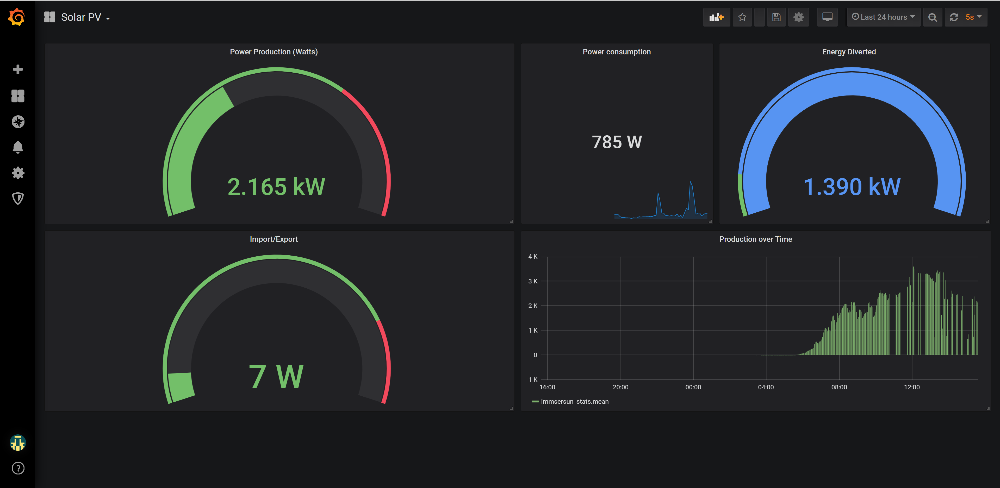

# sunscraper

===
This project scrapes data from the live.myimmersun.com website which owners of immersun units 
can use to monitor solar power generation/power consumption/power diverted to water heater. 

It is a (very) simple python script that simply grabs the page, and searches for the required
elements. 

It then uses the InfluxDBClient library to connect to an influxDB server and insert the data
in JSON format including a timestamp. Then you can visualise the data using grafana. If you 
do not already have a grafana/influxDB setup then I suggest you look at this simeple docker
one

	philhawthorne/docker-influxdb-grafana

you can bring up an entire docker influxdb/grafana setup in just a few minutes.
see https://hub.docker.com/r/philhawthorne/docker-influxdb-grafana for details. 

if you got the above working ok then you should have a container running, with two volumes (for grafana and influx configs) 
and it should listen on port 8086 for influxdb (grafana will be on port 3003)

===

How to use this script: 

1. Setup an influxdb / grafana setup (see above for quick docker setup) 
2. No need to create a database or user if you used above docker setup
3. Clone this repository onto a linux system .... git clone https://github.com/mattfaraday/sunscraper.git
4. Edit the script and change db_host, db_name etc to match your influxdb setup
5. Install all the necessary libraries to use this script by running   pip3 install -r requirements.txt 
6. Run the script and make sure it works 
   1. python /path/to/sunscraper/sunscraper.py 
   2. check in influx db :
      run "influx"
      use sunscraper
      select * from immersun_stats
7. Now configure a crontab to run the script as often as required

Note it was written in Python3 but seems to work equally well in 2.x branches i've tried. 
At this point data should start being written to your influxDB and you can now configure a grafana source
and dashboard to visualise the data if required. Or you can now query your influxdb and do something with
the data.

===

Here is an example of what you can do in graphana to view the collected data

===

Notes: 

The script was just a bit of fun for me, and it could use major improvement including:

* error handling - currently there is none and if it fails to connect to a database/scraping website
it will just crash. However that just means there will be no data in the influxDB until connectivity
is restored so not entirely fatal. 

* handling of divert / export data. - Not entirely sure this is working correctly when nothing is being
diverted and when power is being exported. 

I will either add these features and improve on the script over time, or hopefully someone will 
help contribute to the project. However, if you just need immersun statistics then this script will
provide them. 

You can easily swap the influxdb for any other database (e.g. MySQL) but influx is designed for sensor data
over time and is a good fit for the project. 

I may consider making a docker container that will do everything required.

